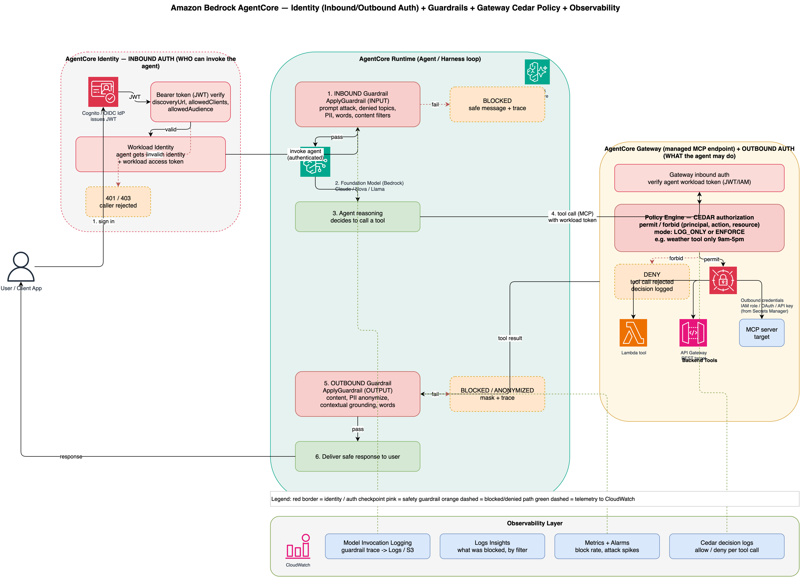
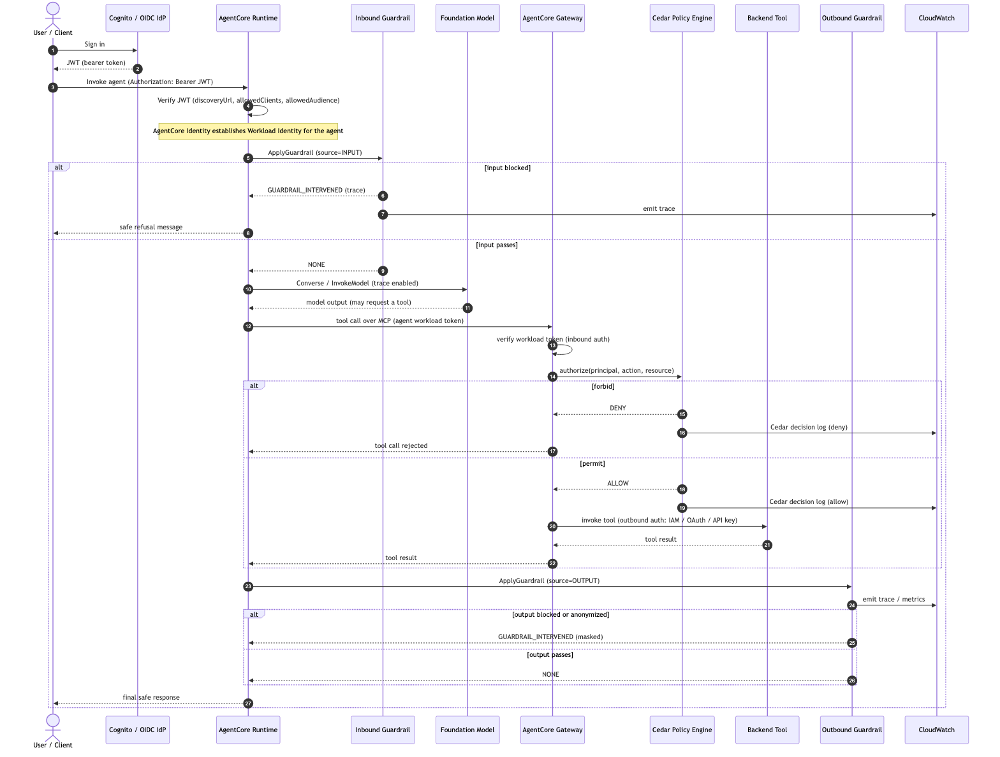
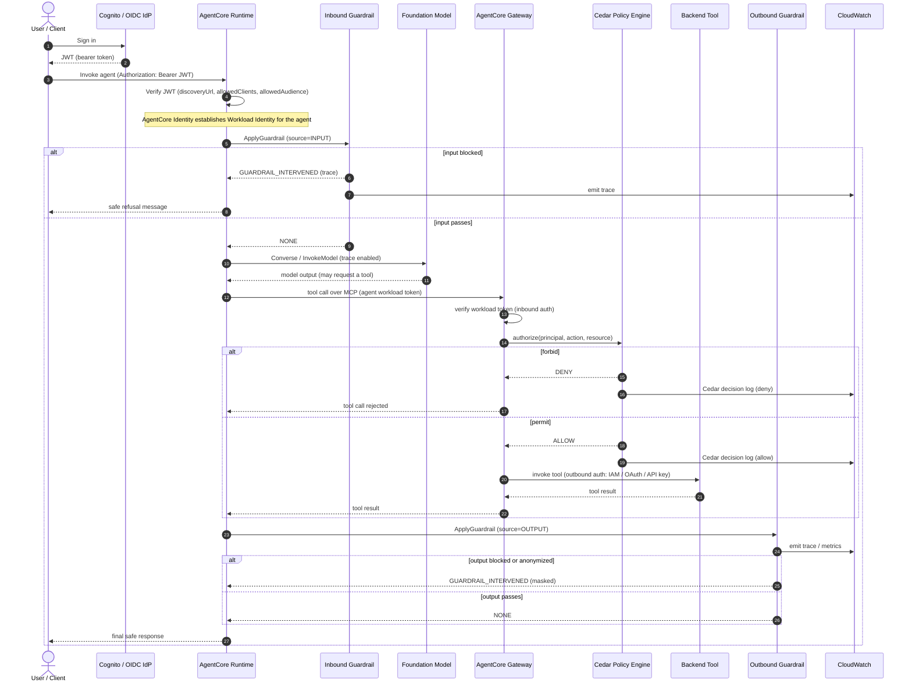
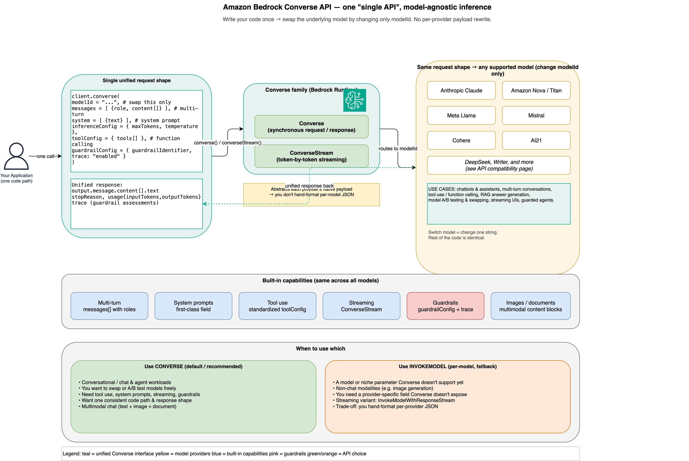

# Observability for Amazon Bedrock Guardrails, with AgentCore Identity & Gateway Cedar Policy

A practical writeup on **how to see what a Bedrock Guardrail blocked and why**, and how that fits alongside **AgentCore Identity** (who can invoke an agent) and the **AgentCore Gateway Cedar Policy Engine** (what an agent is allowed to do).

> The controls here fall into two families that are easy to confuse:
> - **Guardrails** govern *content* — what text goes in and what comes out (safety, PII, denied topics).
> - **Identity + Cedar policies** govern *access and actions* — who may invoke the agent, and which tools the agent may call.
>
> Both feed **CloudWatch**, so every "blocked" and every "denied" becomes queryable.

---

## Table of contents

1. [The big picture](#1-the-big-picture)
2. [Diagrams](#2-diagrams)
3. [Guardrails observability — what got blocked and why](#3-guardrails-observability--what-got-blocked-and-why)
4. [AgentCore Identity — inbound auth (who can invoke the agent)](#4-agentcore-identity--inbound-auth-who-can-invoke-the-agent)
5. [AgentCore Gateway + Cedar — outbound auth (what the agent may do)](#5-agentcore-gateway--cedar--outbound-auth-what-the-agent-may-do)
6. [How it all connects to CloudWatch](#6-how-it-all-connects-to-cloudwatch)
7. [Practical workflow](#7-practical-workflow)
8. [Repo contents](#8-repo-contents)
9. [Accuracy notes / verify-before-you-ship](#9-accuracy-notes--verify-before-you-ship)

---

## 1. The big picture

Amazon Bedrock AgentCore layers **four independent, observable control points** around an agent:

| # | Control | Question it answers | Mechanism |
|---|---------|--------------------|-----------|
| 1 | **Inbound identity** | *Who* can invoke the agent? | AgentCore Identity — JWT/IAM verification + Workload Identity |
| 2 | **Inbound guardrail** | What *content* may come in? | `ApplyGuardrail` on the user prompt |
| 3 | **Cedar authorization** | What *actions* (tools) may the agent take? | AgentCore Gateway Policy Engine (Cedar) |
| 4 | **Outbound guardrail** | What *content* may go out? | `ApplyGuardrail` on model/tool output |

Identity answers *who and which actions*; Guardrails answer *what content*. Everything emits telemetry to CloudWatch.

---

## 2. Diagrams

### Architecture flow (with AWS icons)



Editable source: [`diagrams/architecture-flow.drawio`](diagrams/architecture-flow.drawio) (open in [draw.io](https://app.diagrams.net/)). It shows the end-to-end path: user → Identity (inbound auth) → inbound guardrail → model → agent reasoning → Gateway (inbound auth + Cedar) → outbound credentials → backend tools → outbound guardrail → response, with all checkpoints emitting to CloudWatch.

### Sequence diagram (request/response timeline)



Source: [`diagrams/sequence-flow.mmd`](diagrams/sequence-flow.mmd).



---

## 3. Guardrails observability — what got blocked and why

### The trace is opt-in

Every model invocation with a guardrail attached (`Converse`, `InvokeModel`, or the standalone `ApplyGuardrail`) can return a **`trace`** — but only if you ask for it.

**Converse API:**
```json
{
  "guardrailConfig": {
    "guardrailIdentifier": "abc123xyz",
    "guardrailVersion": "1",
    "trace": "enabled"
  }
}
```

**ApplyGuardrail (standalone, no model call):**
```python
import boto3

client = boto3.client("bedrock-runtime")

response = client.apply_guardrail(
    guardrailIdentifier="abc123xyz",
    guardrailVersion="1",
    source="INPUT",          # or "OUTPUT"
    content=[{"text": {"text": user_input}}],
)

print(response["action"])       # "GUARDRAIL_INTERVENED" or "NONE"
print(response["assessments"])  # the detailed breakdown of what triggered
```

### Reading the assessment

The `assessments` array tells you exactly which policy fired, at what confidence, and what action was taken:

```json
{
  "action": "GUARDRAIL_INTERVENED",
  "outputs": [{ "text": "Sorry, I can't help with that request." }],
  "assessments": [{
    "contentPolicy": {
      "filters": [{ "type": "VIOLENCE", "confidence": "HIGH", "filterStrength": "HIGH", "action": "BLOCKED" }]
    },
    "sensitiveInformationPolicy": {
      "piiEntities": [{ "type": "EMAIL", "match": "john@example.com", "action": "ANONYMIZED" }]
    },
    "topicPolicy": {
      "topics": [{ "name": "Legal Advice", "type": "DENY", "action": "BLOCKED" }]
    }
  }]
}
```

Each policy type reports independently:

| Policy | What it reports | Possible actions |
|--------|-----------------|------------------|
| `contentPolicy` | Hate, insults, sexual, violence, misconduct, prompt attack | `BLOCKED` |
| `topicPolicy` | Denied topics you defined | `BLOCKED` |
| `wordPolicy` | Profanity and custom word lists | `BLOCKED` |
| `sensitiveInformationPolicy` | PII and regex matches | `BLOCKED`, `ANONYMIZED` |
| `contextualGroundingPolicy` | Grounding and relevance scores | `BLOCKED` |

The fields worth logging: `type` (category), `action` (blocked vs anonymized), and `confidence` / `filterStrength` (how sure the guardrail was).

---

## 4. AgentCore Identity — inbound auth (who can invoke the agent)

Inbound auth is the agent's front door. It answers **who is allowed to invoke the agent**.

1. **User signs in** to an OIDC identity provider (Cognito is common; any OIDC IdP works) and receives a **JWT bearer token**.
2. The AgentCore Runtime's inbound authorizer **verifies the JWT** against the configured `discoveryUrl`, `allowedClients`, and `allowedAudience`. An invalid/untrusted token yields `401/403` — the agent is never invoked.
3. Once authenticated, AgentCore Identity establishes a **Workload Identity** for the agent. The agent gets *its own identity* and a **workload access token** — becoming a first-class principal that can itself be authorized and audited.

**You control "who" by configuring the authorizer** — allowed clients, audience, and issuer (discovery URL).

Example inbound authorizer configuration (conceptual):
```json
{
  "authorizerType": "CUSTOM_JWT",
  "authorizerConfiguration": {
    "customJWTAuthorizer": {
      "discoveryUrl": "https://<your-idp>/.well-known/openid-configuration",
      "allowedClients": ["agent-client-id"],
      "allowedAudience": ["my-agent-api"]
    }
  }
}
```

---

## 5. AgentCore Gateway + Cedar — outbound auth (what the agent may do)

When the agent decides to call a tool, the request goes to the **AgentCore Gateway** (a managed MCP endpoint) carrying the agent's workload token. Two distinct gates apply:

1. **Gateway inbound auth** — verifies the agent's workload token (authentication: "is this really my agent?").
2. **Cedar Policy Engine** — the authorization gate: *is this authenticated agent allowed to invoke this specific tool, under these conditions?*

### Cedar in one paragraph

Cedar is **default-deny**: if no `permit` matches, the action is denied. A `forbid` **always** overrides a `permit`. Policies are written over `(principal, action, resource)` with optional `when { ... }` conditions. The engine runs in one of two modes:

- **`LOG_ONLY`** — evaluates and logs the decision but does not block. **Always start here.**
- **`ENFORCE`** — actively allows or denies. Switch to this only after inspecting the LOG_ONLY logs.

### Sample policy

See [`policies/business-hours.cedar`](policies/business-hours.cedar):

```cedar
// Admins may invoke any tool.
permit(principal in Group::"Admins", action, resource);

// Users may invoke the weather tool, but only 09:00-17:00 UTC.
permit(
    principal in Group::"Users",
    action == Action::"weather___get_forecast",
    resource
)
when { context.hourOfDay >= 9 && context.hourOfDay < 17 };

// Forbid everyone from destructive tools (forbid wins over permit).
forbid(principal, action, resource)
when { action.name like "*delete*" || action.name like "*purge*" };
```

> Tool names exposed through the Gateway MCP endpoint are prefixed with the target name:
> `${target_name}___${tool_name}` (three underscores) — hence `weather___get_forecast`.

### Then: outbound credentials

On `permit`, the Gateway attaches **outbound credentials** — an IAM role, OAuth token, or API key (pulled from Secrets Manager) — to actually reach the backend **tool** (Lambda, API Gateway REST, MCP server). This is a second layer of "what," scoping what the backend itself will allow.

### Attaching the policy engine to a gateway

```json
{
  "gateways": [{
    "name": "MyGateway",
    "policyEngineConfiguration": {
      "policyEngineName": "MyPolicyEngine",
      "mode": "LOG_ONLY"
    }
  }]
}
```

---

## 6. How it all connects to CloudWatch

Every checkpoint emits telemetry so blocking/denial becomes measurable.

### Enable model invocation logging (guardrail traces)
```bash
aws bedrock put-model-invocation-logging-configuration \
  --logging-config '{
    "cloudWatchConfig": {
      "logGroupName": "/aws/bedrock/guardrails",
      "roleArn": "arn:aws:iam::<account-id>:role/BedrockLoggingRole"
    },
    "textDataDeliveryEnabled": true
  }'
```

### Query "what got blocked" with Logs Insights
```
fields @timestamp
| filter output.outputBodyJson.amazon-bedrock-guardrailAction = "INTERVENED"
| parse @message /"type":"(?<filterType>[A-Z_]+)","confidence":"(?<confidence>[A-Z]+)"/
| stats count(*) as blockCount by filterType
| sort blockCount desc
```

### Emit a custom metric per intervention (for dashboards/alarms)
```python
import boto3
cw = boto3.client("cloudwatch")

def record_guardrail_intervention(response, guardrail_id="abc123xyz"):
    if response.get("action") != "GUARDRAIL_INTERVENED":
        return
    for assessment in response.get("assessments", []):
        for f in assessment.get("contentPolicy", {}).get("filters", []):
            cw.put_metric_data(
                Namespace="GuardrailObservability",
                MetricData=[{
                    "MetricName": "Blocked",
                    "Dimensions": [
                        {"Name": "FilterType", "Value": f["type"]},
                        {"Name": "GuardrailId", "Value": guardrail_id},
                    ],
                    "Value": 1,
                    "Unit": "Count",
                }],
            )
```

### Gateway & Cedar telemetry
- Gateway **management events** (Create/Get/Update/Delete Gateway and Target) are logged to **CloudTrail** by default.
- Gateway **invocation events** (`InvokeGateway`) are **data events** — enable them explicitly via advanced event selectors on a trail.
- Live tail: `aws logs tail /aws/bedrock-agentcore/gateways/<GATEWAY_ID> --follow`
- **Cedar decision logs** record allow/deny per tool call — the authorization equivalent of the guardrail trace. Start in `LOG_ONLY` to observe decisions before enforcing.

---

## 7. Practical workflow

1. **Development / debugging** — call `ApplyGuardrail` (or set `trace: enabled`) and read `assessments` directly to understand why a specific input/output was blocked. For Cedar, deploy in `LOG_ONLY` and read the decision logs.
2. **Aggregate analysis** — enable model invocation logging + Logs Insights to see the distribution of block reasons across all traffic.
3. **Dashboards & alerting** — emit custom metrics per filter type (or use built-in `AWS/Bedrock/Guardrails` metrics) so blocking becomes monitored — e.g., alarm when `PROMPT_ATTACK` blocks spike.
4. **Enforce** — once LOG_ONLY logs look right, switch the Cedar policy engine to `ENFORCE`.

---

## Appendix: the Converse API (Bedrock's "single API")

The guardrail examples above attach `guardrailConfig` to a **`Converse`** call. Converse is
Amazon Bedrock's **single, unified, model-agnostic inference API** — one request/response shape
that works across providers (Claude, Nova/Titan, Llama, Mistral, Cohere, AI21, and more). You
write the code once and **switch models by changing only `modelId`**, with no per-provider
payload rewrite.



Editable source: [`diagrams/converse-api.drawio`](diagrams/converse-api.drawio).

**Converse vs InvokeModel**

| | `Converse` (the "single API") | `InvokeModel` (per-model) |
|---|---|---|
| Request/response shape | One consistent schema for all models | Different JSON per provider |
| Switching models | Change `modelId` only | Rewrite the payload |
| Multi-turn / system prompt / tool use | First-class fields | Provider-specific |
| Streaming | `ConverseStream` | `InvokeModelWithResponseStream` |
| Guardrails | `guardrailConfig` + `trace` | `guardrailIdentifier` params |

Minimal example — the same code targets any model by swapping `modelId`:

```python
import boto3
client = boto3.client("bedrock-runtime")

resp = client.converse(
    modelId="anthropic.claude-3-5-sonnet-20241022-v2:0",   # swap for Nova / Llama / etc.
    messages=[{"role": "user", "content": [{"text": "Summarize AgentCore in one line."}]}],
    system=[{"text": "You are concise."}],
    inferenceConfig={"maxTokens": 200, "temperature": 0.2},
    guardrailConfig={"guardrailIdentifier": "abc123xyz", "guardrailVersion": "1", "trace": "enabled"},
)
print(resp["output"]["message"]["content"][0]["text"])
```

Use **Converse** by default; fall back to **InvokeModel** only for models/parameters Converse
doesn't support yet or non-chat modalities (e.g. image generation). Check the AWS
"API compatibility" page to confirm a specific model supports the Converse family.

---

## Related writeup

- **AgentCore Memory** (now a separate repo): **https://github.com/catchmeraman/agentcore-memory-explained** — how AgentCore Memory works: parallel sessions, isolation across users, short-term vs long-term, preferences, retention, and the managed-vs-self-managed (DynamoDB single-table) storage model, with an architecture diagram and an end-to-end customer-support code sample.

## 8. Repo contents

```
.
├── README.md                         # this writeup (Guardrails observability + Identity + Cedar)
├── diagrams/
│   ├── architecture-flow.drawio      # AWS-iconified end-to-end flow (editable)
│   ├── architecture-flow.png         # rendered PNG (embedded above)
│   ├── sequence-flow.mmd             # Mermaid sequence diagram source
│   ├── sequence-flow.png             # rendered PNG (embedded above)
│   ├── converse-api.drawio           # Converse API explainer (editable)
│   └── converse-api.png              # rendered PNG (embedded in appendix)
└── policies/
    └── business-hours.cedar          # sample Cedar authorization policy
```

---

## 9. Accuracy notes / verify-before-you-ship

These are illustrative and should be validated against your own account and the current AWS docs before you rely on them:

- **Logs Insights field paths**: the JSON key names in model invocation logs vary by model and by API (`Converse` vs `InvokeModel`). Confirm the actual paths and adjust the `parse` regex to match your log structure.
- **Metric names**: confirm the `AWS/Bedrock/Guardrails` namespace/metric names in your CloudWatch console before wiring alarms.
- **Cedar entity/attribute names**: `Action::"weather___get_forecast"`, `context.hourOfDay`, and the group names are illustrative. The Policy Engine derives a Cedar schema from *your* gateway's tool catalog — validate against it (policies validate with `FAIL_ON_ANY_FINDINGS` by default).
- **Inbound authorizer fields** (`discoveryUrl`, `allowedClients`, `allowedAudience`): Cognito is one common OIDC IdP; the mechanism is generic OIDC/JWT.
- **Workload token passing to the Gateway**: in a fully managed AgentCore Harness some of this is handled for you; in a custom agent loop you wire it explicitly. Verify against your SDK/runtime setup.

### References
- Amazon Bedrock Guardrails — https://docs.aws.amazon.com/bedrock/latest/userguide/guardrails.html
- AgentCore Gateway — https://docs.aws.amazon.com/bedrock-agentcore/latest/devguide/gateway.html
- Amazon Verified Permissions / Cedar — https://docs.cedarpolicy.com/

---

*Authored as a blog companion. PRs and corrections welcome.*
